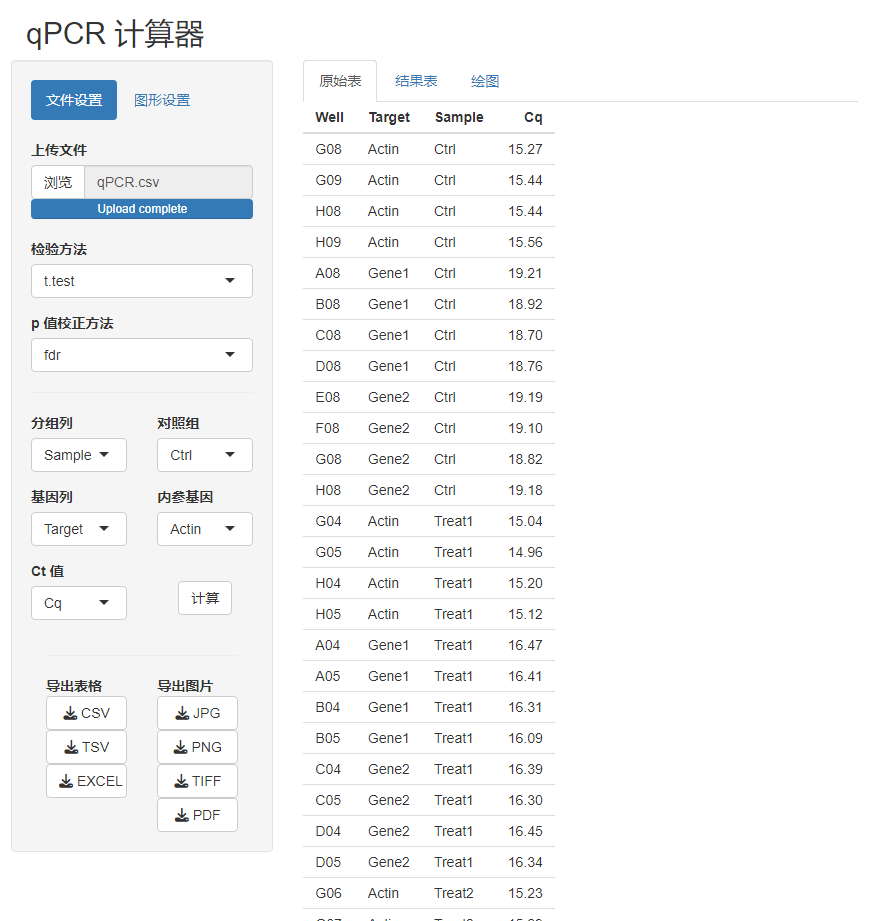
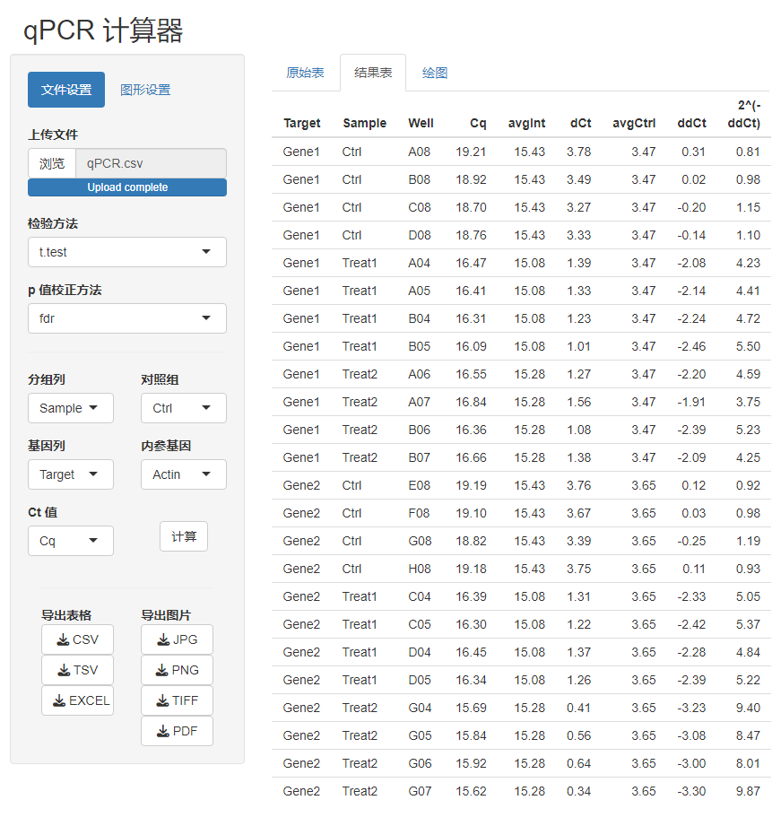
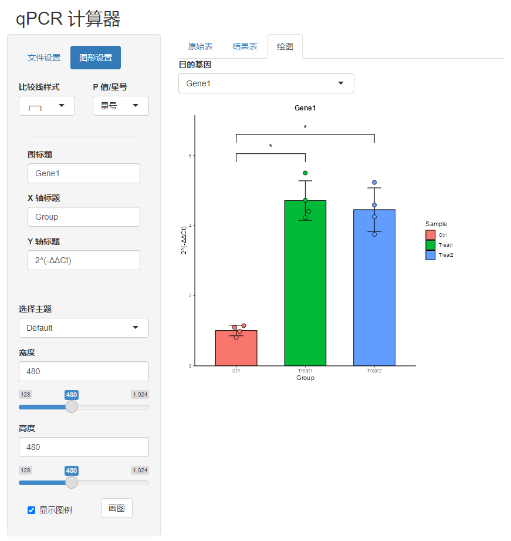

# qPCRcalculator

一个通过 Shiny 编写的 qPCR 计算器，可以进行基础的绘图和统计检验。

需要搭载在 R 语言环境下运行。

## 安装方法

```R
if(!require(devtools)){install.packages("devtools")}
devtools::install_github("NiannianSoHungry/qPCRcalculator")
```

## 赞助作者

<table align="center"><tr>
  <td><a href="https://afdian.net/a/momomoshan"></a></td>
  <td><a href="https://space.bilibili.com/501417427/"></a></td>
  </tr>
  <tr>
    <td><a href="https://afdian.net/a/momomoshan">爱发电</a></td>
    <td><a href="https://space.bilibili.com/501417427" style="text-decoration:none; color:black">哔哩哔哩</a></td>
  </tr></table>

## 运行界面







## 下一步计划

- [ ] 添加更多主题
- [ ] 打包为桌面版
  
  
  
  
  
  
  
  
  
  
  
  
  
  
  
  
  
  


